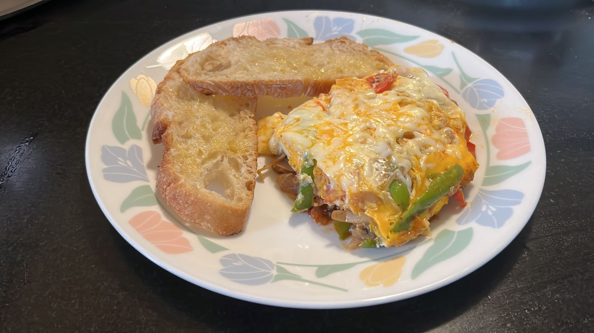

# French Egg 

I have no idea what this is actually called but it's a thick egg dish with a yoke-y and cheesy layer over a bed of vegetables. Serves 3.

---

## Ingredients
- 6 eggs
- 3 small to medium tomatoes
- 3 small to medium onions
- 3 small to medium capsicums
- 12-15 mushrooms
- One whole garlic
- Salt, pepper
- Chilli flakes, pasta mix
- Olive oil or butter

---

## Equipment
- Cutting board and knife
- A large cooking pot

---

## Instructions
### Preparation
1. Peel the garlic cloves and crush them (***Pro-Tip:** Crush the cloves with the side of a knife to make it easy to peel*)
2. Chop the onions, tomatoes, capsicum and mushroom in long vertical slices

### Cooking
1. Pour some olive oil in the cooking pot and heat it slightly
2. Add the crushed garlic to the oil and wait for it to brown slightly
3. Add the onions to the pot and cook until translucent / brown
4. Add the remaining vegetables and cook for a few minutes
5. Add 1-1.5 teaspoons of salt, a few pinches of pepper, chilli powder and pasta mix
6. Crack the eggs over the vegetables and spread the yoke with a fork
7. Sprinkle salt and pepper over the eggs
8. Grate as much cheese as you like over the eggs
9. Cover the pot and let it cook for about 5 minutes till the egg is fully cooked  

---

