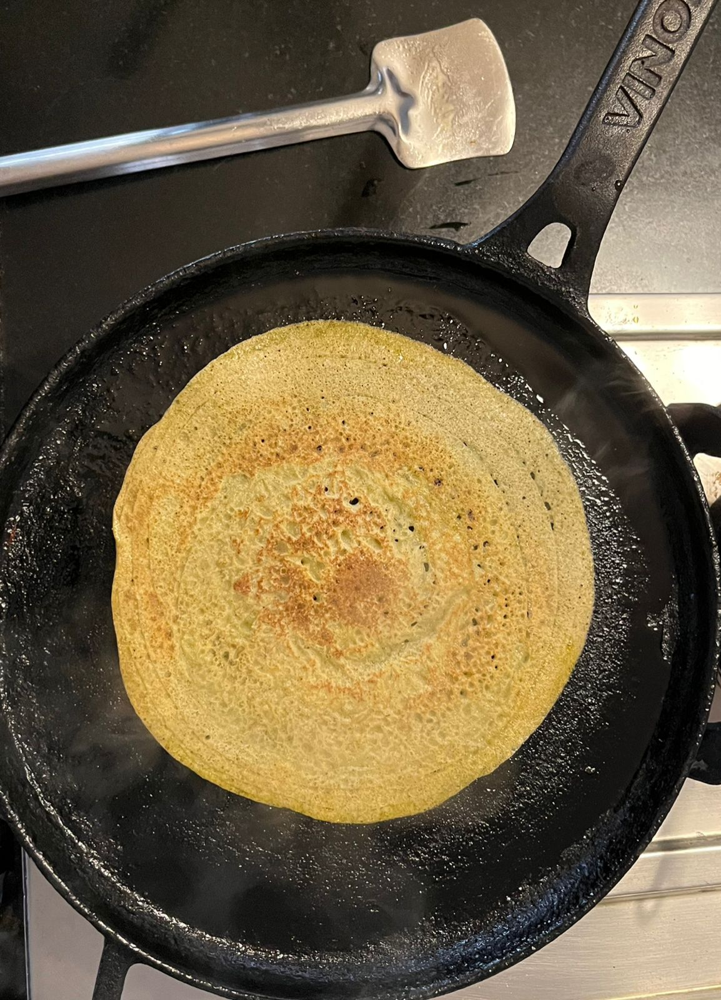

# *Moong Daal Cheela*

Moong daal cheela served with tomato *chutney* and curd.

---

## Ingredients
- 2-4 cups of *moong daal*
- 2 teaspoons of *hing*
- Salt
- 1 garlic
- 5 green chillies
- 3 tomatoes
- Mustard oil

---

## Equipment
- Cutting board and knife
- Blender
- A cooking pan 

---

## Instructions
### Tomato Chutney
1. Peel the garlic cloves
2. Chop green chillies and tomatoes into medium sized cubes
3. Blend garlic, chillies and tomatoes with salt

### Cheela
1. Soak *moong daal* in water for 1-1.5 hours
2. Blend the *daal* with salt and *hing* till you achieve a paste-like consistency, add water as needed
3. Heat a pan and spread mustard oil on it
4. Add the paste on the pan and sprinkle mustard oil around the edges and a few drops on top
5. Flip the *cheela* when the edges start to brown
6. Cook till brown and serve with chutney and curd

---

