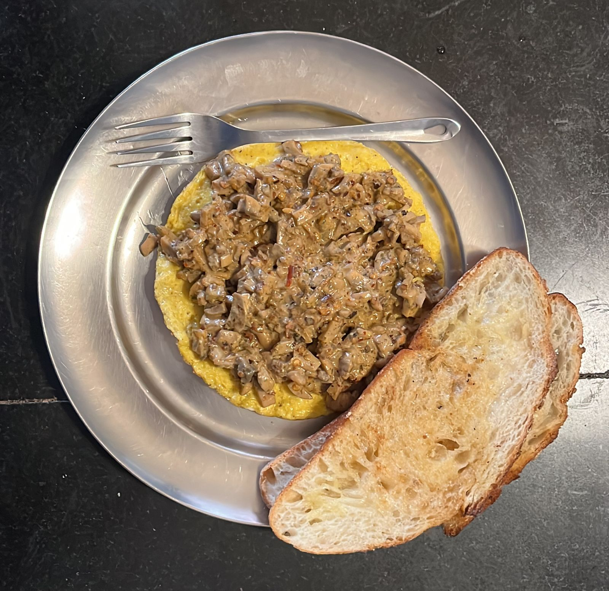

# Mushroom Omelette Roll

Creamy mushrooms served in an omelette roll. This recipe is for 3 omelettes.

---

## Ingredients
- 6 eggs
- 20-30 mushrooms
- One whole garlic
- 3-4 tablespoon of fresh cream
- Salt, pepper
- Olive oil 
- Chilli flakes, pasta mix

---

## Equipment
- Cutting board and knife
- A cooking pan or two

---

## Instructions
### Preparation
1. Peel the garlic cloves and crush them (Pro-Tip: Crush the cloves with the side of a knife to make it easy to peel)
2. Chop the mushroom into small cubes

### Cooking
1. Heat a pan and spread olive oil on the pan
2. Cook the crushed garlic in the oil until brown with chilli flakes
3. Add the mushrooms to the pan and cook until brown
4. Whisk two eggs at a time with pinches of salt and pepper
5. Pour the eggs on a pan with olive oil and cook
6. Serve the omelette topped with the cooked mushroom

---
