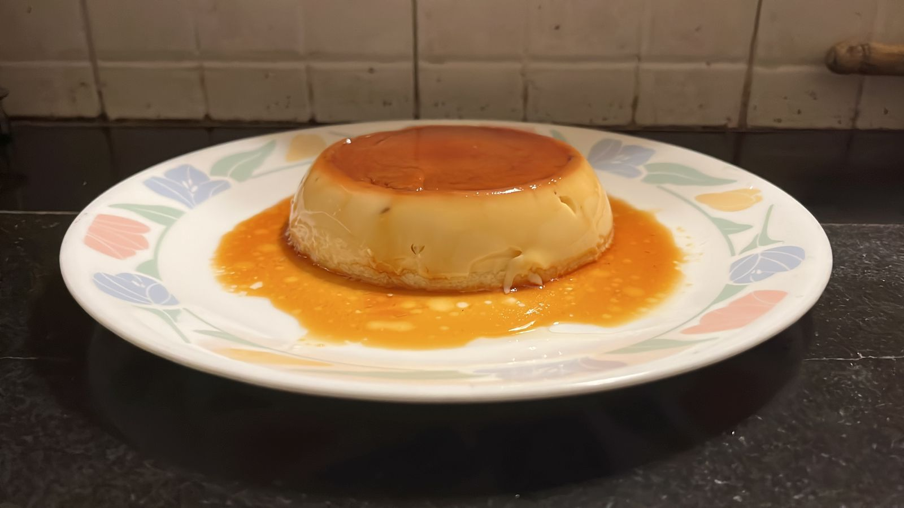

# Caramel Custard

Easy dessert that does not require an oven. Contains eggs. 

---

## Ingredients
- 6 table spoons of sugar
- 2 eggs
- 1 cup milk
- 2 teaspoons of vanilla extract

---

## Equipment
- Pan and stirring spoon
- A metal bowl to act as the mold
- A cooking pot and lid

---

## Instructions
### Caramel
1. Add 4 tablespoons of sugar and two tablespoons of water to a pan
2. Heat on a low flame till it turns into light brown caramel
3. Cover the mold in a thin layer of oil and pour the caramel into it

### Custard
1. Heat the milk and mix 2 tablespoons of sugar 
2. Beat the eggs and add the milk and vanilla extract
3. Strain the mixture and add to the mold
4. Cover the mold with foil
5. Place a metal stand in a large cooking pot and fill the pot with water
6. Place the mold on the stand and cover the pot with a lid
7. Steam the mold in the pot of boiling water for 25 minutes
8. Remove the mold from the pot and keep it to cool in the fridge for 3 hours
9. Turn the mold over to serve the caramel custard 

---
